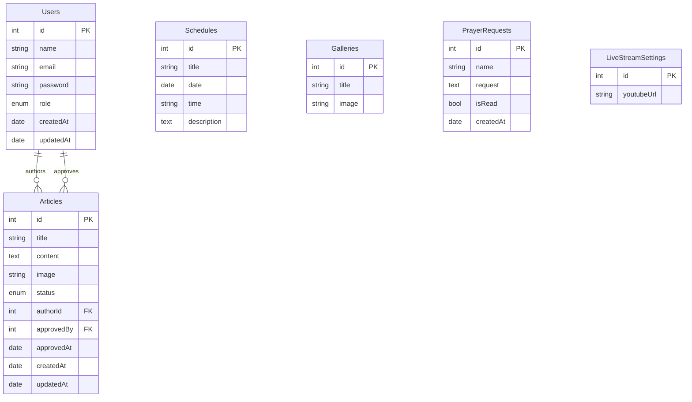

# Fullstack Website Gereja Modern (Production Ready)

Starter fullstack website gereja dengan arsitektur modern, role-based access, approval workflow, dan deployment siap production.

## Stack

- Backend: Node.js, Express.js, PostgreSQL, Sequelize ORM, JWT, bcrypt, multer, dotenv, CORS, Morgan, Helmet
- Frontend: React (Vite), React Router, Axios, Context API, TailwindCSS, Responsive UI, Dark Mode
- Ops: Docker, Docker Compose, Nginx reverse proxy, GitHub Actions CI

## Fitur Utama

### Public
- Home
- Tentang Gereja
- Jadwal Ibadah
- Artikel / Renungan (pagination + search)
- Galeri Foto
- Live Streaming (YouTube embed)
- Form Permohonan Doa
- Kontak

### Authentication + Authorization
- Register/Login/Logout
- Login dengan Google (otomatis membuat akun role `jemaat` saat pertama login)
- JWT Authentication
- Password hashing (bcrypt)
- Role: `admin`, `multimedia`, `jemaat`
- Protected route (frontend) + middleware authorization (backend)

### Dashboard
- Admin:
  - CRUD artikel
  - Approve/Reject artikel (approval system)
  - CRUD jadwal ibadah
  - CRUD galeri
  - Lihat/hapus permohonan doa
  - Kelola user
  - Ubah link live streaming
  - Dashboard statistics
- Multimedia:
  - Create artikel (masuk pending approval)
  - Upload galeri
  - Update link live streaming

### Advanced
- Email notification saat prayer request masuk (opsional via SMTP env)
- CMS-style editor (rich text basic)
- Dark mode toggle (persist localStorage)
- Upload gambar renungan bisa disimpan permanen ke Cloudinary (opsional, disarankan untuk production)

## Struktur Folder

```txt
.
├── server/
│   ├── config/
│   ├── controllers/
│   ├── middleware/
│   ├── migrations/
│   ├── models/
│   ├── routes/
│   ├── seeders/
│   ├── services/
│   ├── uploads/
│   ├── validators/
│   ├── app.js
│   ├── server.js
│   └── sql-init.sql
├── client/
│   ├── src/
│   │   ├── components/
│   │   ├── context/
│   │   ├── layouts/
│   │   ├── pages/
│   │   ├── router/
│   │   ├── services/
│   │   ├── App.jsx
│   │   └── main.jsx
├── nginx/
│   └── default.conf
├── docker-compose.yml
└── .github/workflows/ci.yml
```

## Database Design (PostgreSQL)

### Tables
- `Users`: id, name, email, password, role, createdAt, updatedAt
- `Articles`: id, title, content, image, status, approvedBy, approvedAt, authorId, createdAt, updatedAt
- `Schedules`: id, title, date, time, description, createdAt, updatedAt
- `Galleries`: id, title, image, createdAt, updatedAt
- `PrayerRequests`: id, name, request, isRead, createdAt
- `LiveStreamSettings`: id, youtubeUrl, createdAt, updatedAt

### ERD (Sederhana)



## REST Endpoint Ringkas

### Public
- `POST /api/auth/register`
- `POST /api/auth/login`
- `POST /api/auth/google`
- `GET /api/articles?page=1&limit=6&search=kasih`
- `GET /api/articles/:id`
- `GET /api/schedules`
- `GET /api/galleries`
- `GET /api/live-stream`
- `POST /api/prayer-requests`

### Authenticated
- `GET /api/auth/me`

### Admin + Multimedia
- `GET /api/articles/manage`
- `POST /api/articles`
- `PUT /api/articles/:id`
- `DELETE /api/articles/:id`
- `POST /api/galleries`
- `PUT /api/live-stream`

### Admin only
- `PATCH /api/articles/:id/review` (`approve` / `reject`)
- `POST /api/schedules`
- `PUT /api/schedules/:id`
- `DELETE /api/schedules/:id`
- `GET /api/prayer-requests`
- `PUT /api/prayer-requests/:id/read`
- `DELETE /api/prayer-requests/:id`
- `GET /api/users`
- `POST /api/users`
- `PUT /api/users/:id`
- `DELETE /api/users/:id`
- `GET /api/dashboard/stats`

## Contoh File Implementasi

- Sequelize model: `server/models/article.js`
- Controller: `server/controllers/articleController.js`
- Route: `server/routes/articleRoutes.js`
- JWT middleware: `server/middleware/authMiddleware.js`
- Axios config: `client/src/services/api.js`
- Protected route: `client/src/router/ProtectedRoute.jsx`

## Setup Local (Step-by-Step)

### 1) Database
1. Buat DB PostgreSQL:
   - Jalankan `server/sql-init.sql` atau `CREATE DATABASE church_db;`
2. Copy env backend:
   - `cd server && cp .env.example .env`
3. Isi kredensial DB di `.env`.

### 2) Backend
1. `cd server`
2. `npm install`
3. `npm run migrate`
4. `npm run seed`
5. `npm run dev`

Default account (auto-create saat backend start di mode development):
- Admin: `admin@church.local` / `Admin123!`
- Multimedia: `multimedia@church.local` / `Multi123!`

### 3) Frontend
1. `cd client && cp .env.example .env`
2. `npm install`
3. `npm run dev`

Frontend: `http://localhost:5173` (kadang auto pindah ke `5174` jika port bentrok)
Backend: `http://localhost:5000`

### 4) Setup Google Login (Opsional)
1. Buka Google Cloud Console -> APIs & Services -> Credentials.
2. Buat OAuth Client ID dengan tipe `Web application`.
3. Isi `Authorized JavaScript origins`:
   - Local: `http://localhost:5173` dan `http://localhost:5174`
   - Production frontend domain Anda (contoh: `https://namasitus.vercel.app`)
4. Masukkan Client ID ke:
   - `server/.env` -> `GOOGLE_CLIENT_ID=...`
   - `client/.env` -> `VITE_GOOGLE_CLIENT_ID=...`
5. Restart backend dan frontend setelah env diubah.

## Konfigurasi SMTP (Opsional)

Di `server/.env` isi:
- `SMTP_HOST`
- `SMTP_PORT`
- `SMTP_SECURE`
- `SMTP_USER`
- `SMTP_PASS`
- `SMTP_FROM`
- `ADMIN_NOTIFICATION_EMAIL`

Jika SMTP tidak diisi, API tetap jalan dan email notifikasi otomatis di-skip.

## Deployment Guide

### Docker Compose
1. Pastikan `server/.env` sudah dibuat.
2. Jalankan:
   - `docker compose up --build -d`
3. App tersedia di `http://localhost`.

### Deploy Gratis (Render + Neon + Vercel)
Arsitektur gratis yang paling aman untuk mulai:
- Backend API: Render (free web service)
- PostgreSQL: Neon (free)
- Frontend React: Vercel Hobby (free)

Cara tercepat backend:
- Gunakan `render.yaml` (Blueprint) di root project.
- Saat deploy, isi variabel yang `sync: false` dengan nilai dari Neon + domain Vercel.
- Contoh env siap copy ada di `server/.env.render.example`.

1. Buat database PostgreSQL di Neon (free) lalu catat:
   - Host, Port, Database, User, Password
2. Deploy backend dari folder `server` ke Render:
   - Build Command: `npm install`
   - Start Command: `npm start`
   - Env wajib:
     - `NODE_ENV=production`
     - `PORT=10000`
     - `DB_HOST`, `DB_PORT`, `DB_NAME`, `DB_USER`, `DB_PASSWORD`
     - `DB_SSL=true`
     - `DB_SSL_REJECT_UNAUTHORIZED=true`
     - `JWT_SECRET`, `JWT_EXPIRES_IN`
     - `CLIENT_URL` (isi domain frontend Vercel)
     - `GOOGLE_CLIENT_ID` (jika login Google aktif)
     - `CLOUDINARY_CLOUD_NAME`, `CLOUDINARY_API_KEY`, `CLOUDINARY_API_SECRET` (agar gambar renungan tidak hilang saat redeploy)
     - `CLOUDINARY_FOLDER` (opsional, default `gpt-tanjungpriok/articles`)
3. Deploy frontend dari folder `client` ke Vercel:
   - Framework: Vite
   - Env:
     - `VITE_API_URL=https://<backend-render-domain>/api`
     - `VITE_SERVER_URL=https://<backend-render-domain>`
     - `VITE_GOOGLE_CLIENT_ID` (jika login Google aktif)
4. Update `CLIENT_URL` di backend Render dengan domain frontend final.
5. Di Google OAuth, tambahkan domain frontend production ke `Authorized JavaScript origins`.

### VPS (Nginx + PM2)
- Jalankan backend via PM2 (`pm2 start server.js`).
- Build frontend (`npm run build`) lalu serve static lewat Nginx.
- Reverse proxy `/api` ke backend Node.js.

### Rencana Migrasi ke Hostinger
- Untuk aplikasi Node.js + PostgreSQL seperti project ini, gunakan Hostinger VPS (bukan shared hosting statis).
- Jalankan stack yang sama lewat Docker Compose (`docker-compose.yml`) atau PM2 + Nginx.
- Langkah aman migrasi:
  1. Ekspor database dari hosting gratis.
  2. Impor ke PostgreSQL di VPS Hostinger.
  3. Pindahkan env production.
  4. Arahkan domain ke VPS Hostinger.

## SQL Script

Lihat file `server/sql-init.sql` untuk bootstrap database awal.
